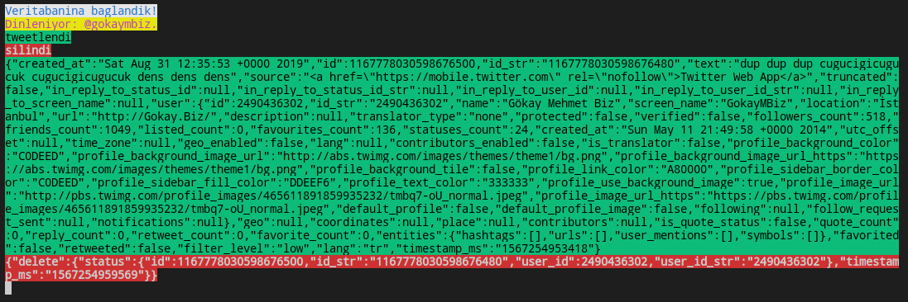

# twitterProfileTracker
> Simple tool for logging tweets of a profile to mysql database

- Kurulum icin:
1. `git clone https://github.com/gokaybiz/twitterProfileTracker`
2. `npm install`
3. `settings.conf` icerigini kendi bilgilerinizle guncelleyin.

------------

- Calistirmak icin:
```shell
npm run start
```
------------

